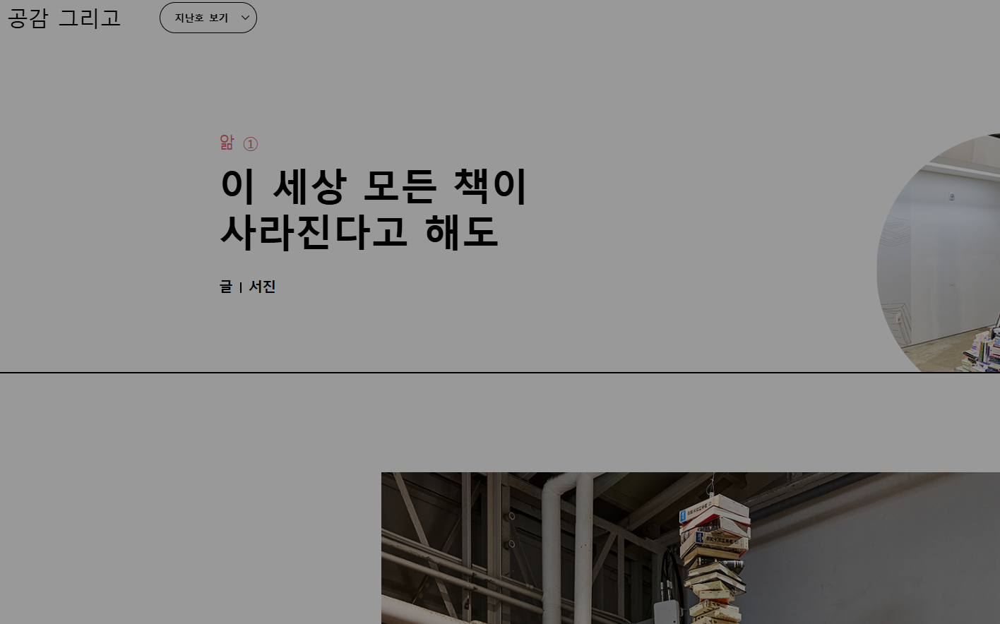
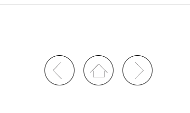
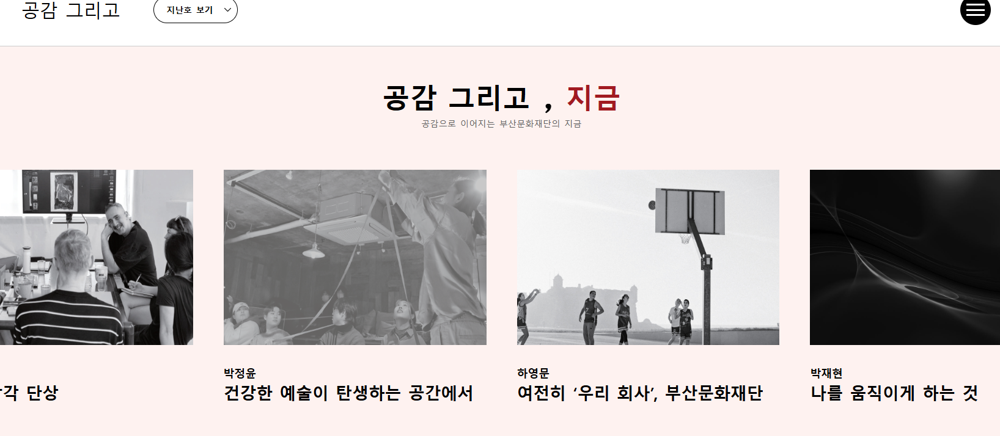

> 👉 ✔ ↪️ ⚠️ 🔴
##### 1) 목록에서 2024년 목록이 최상단에 정렬된다.
>  213

##### 2) 브라우저 탭의 타이틀이 URL 경로이다.
>  개선필요
> 

##### 2) 주 컨텐츠는 예술, 문화 인듯.

##### 4) 매년 계절마다 출간 되는듯

##### 5) 해당 기관은 내용물은 수행사가 담당하지 않는다.

##### 5) 대표 홈페이지와 같은 도메인 사용한다.
↪️ www.bscf.or.kr/webzine2

##### 3) 독자 만족도 조사
> 👉 기본적인 카테고리가 분류된 게시판 형식이다.

##### 3) 부산문화재단 웹진 기능사항 분석
> 👉 끈, 감, 땀, 습 ✔ 각 호차에 특정 한글자 키워드를 선정하여 컨텐츠를 키워드에 맞는 주제에 맞추는 경향이 있다.(100%는 아님)

##### 999) 부산문화재단 웹진 기능사항 분석

> 👉 URL이 2024년 webzine에서 2025년 webzine2로 변경 되었다.

> 👉 https://form.naver.com/response/cIwbIwDlorlW4RCv-8uFGQ ✔ 네이버 설문인데 현재 호차는 메뉴 가려짐 어느 시점에 참여 가능한가 ✔ 설문 참여 시 경품 배부 여부(SMS, 메일 기능 등)

> 👉  ✔ 내가 지금 상단메뉴 어디에 뭘 보고 있는지 인지가 어렵다. ✔ 하위 메뉴 명조차 메뉴 바에 표시가 안되고 있다. 탭의 타이틀에도 하위 메뉴를 표기하는게 좋을듯

> 👉 공감 그리고 51호(2023년 겨울) 부터 이전 호차들 "웹진 링크가 없습니다." 경고 보여주며 접속 불가 ⚠️ 리스트에서 아예 빼던가 접속이 가능하게 하던가 조치 필요

> 👉  하단의 버튼으로 해당 호차의 다른 글로 이동
↪️ 특정 컨텐트 페이지의 URL은 동일하다 opening01.jsp, sub04_2.jsp, sub01_1.jsp, sub01_2.jsp

> 👉 상단의 타이틀 이미지나 영상등은 관리자에서 등록하는가 ✔ 아닌듯하다 형식이 일정하지 않고 형태도 제 각각이다
↪️ https://www.bscf.or.kr/webzine/vol_54/index.jsp
↪️ https://www.bscf.or.kr/webzine/vol_55/index.jsp
↪️ https://www.bscf.or.kr/webzine2/webzine_57/vol_57/index.jsp

> 👉  ✔ 브라우저 사이즈에 따른 이미지 크기 조절이 필요해 보인다