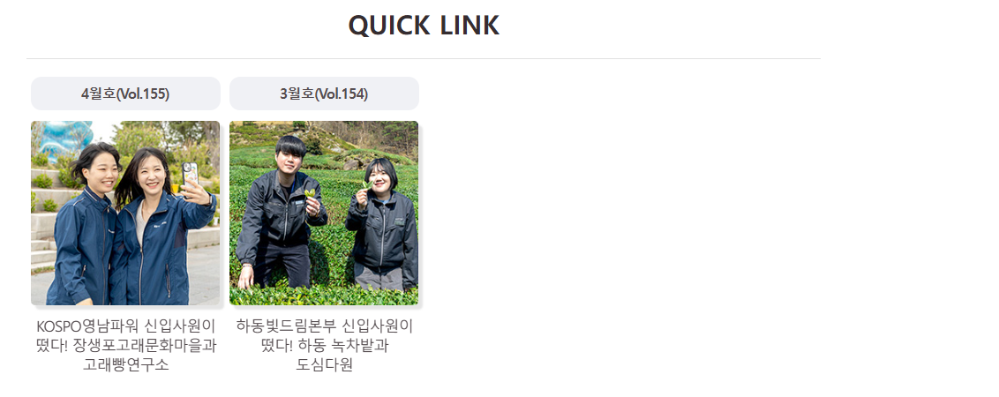
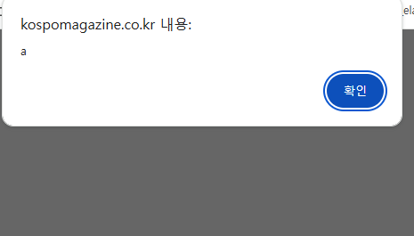
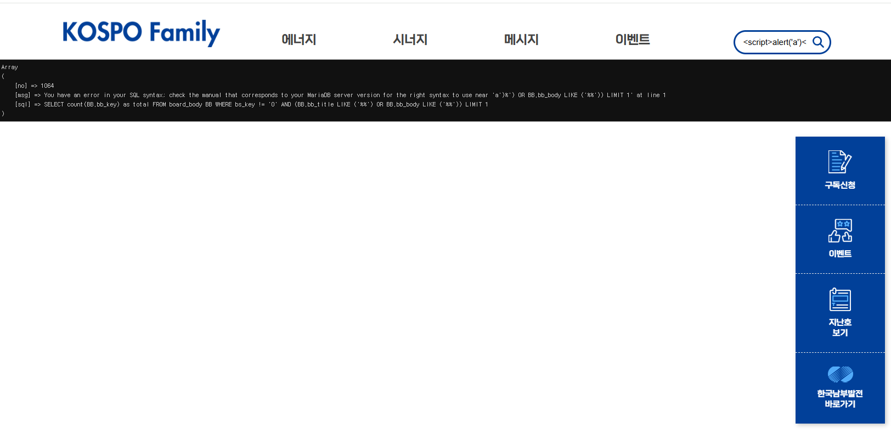

 (12). 현재 미흡점 및 향후 개선 방안(구성방안)
👉 리스트 페이지의 년도와월이 명확하지 않다(특히년도)
👉 내가 지금 상단메뉴 어디에 뭘 보고 있는지 인지가 어렵다. ✔ , , ✔ **얘 처럼 어느 페이지 어느 부분 보고 있는지 기능이 따로 없음 ⚠️ 오류는 아니다만 너무 불편하다.**

👉 전체적으로 일반적인 웹페이지 정도의 기능이 구현되어야 할것같은데 너무 과한 생각인지 판단이 어렵다 ✔ 1). 고객이 원할지 2). 입찰경쟁에서 유리할지 3). 입찰시에는 디자인만 보는데 굳이 구현 필요 없는 것으로 보이긴하다  

👉 현재 이벤트에 본인 확인이 가능하면 좋을듯하다 ✔ 신뢰도 및 보안상  

👉 상단 메뉴가 2022년 편성프로, Click KOSPO, 교양프로, 남전프로, 예능프로 / 2023년 KOSPO 빛드림, 금빛 하루드림, 무지갯빛 재미드림 / 2024년 지속가능, 군계일학, 점입가경 / 2025년 에너지, 시너지, 메시지, 이벤트 이런식으로 의미를 가지고 있으니 | ✔ 1). 2026년 시안에도 의미있는 아이디어를 어필하면 좋을듯(주관적으로는 2025년이 가장 괜찮아 보인다.) 2). 하위 메뉴명이 상위 메뉴명과 완전히는 아니지만 어느정도 관련된 것들의 그룹이다. 3). 2025년 처럼 상단메뉴 무조건 고정하고 마우스오버시 하위 메뉴들 무조건 보이게 이전 년도는 우측상단 메뉴 보기를 클릭해야 해서 불편하다.

👉 http://kospomagazine.co.kr/index.php?page=15&GP=board&GB=search&theme=202503&sf_field=title_body&sf_txt=  | ✔ 1). 이렇게 특정 년도 글 몰아서 볼 수 있으면 사용자 입자에서는 시간 떼우기 좋을듯?(누가 여기서 그러겠냐만), 
✔ 한페이지에 한개 월의 리스트를 보여주는게 좋을듯? 아님 페이징을 번호가 아니라 년/월로 선택하면 편리할듯?

> 👉  | ✔ 우측 네비게이션 메뉴 좋은듯 무조건 살려야됨 이벤트 참가하러 방문할 수도 ✔ https://komipo-webzine.co.kr/page/vol36/16.htmlhttps://komipo-webzine.co.kr/page/vol36/16.html
 이 링크처럼 지난호의 이벤트 내용과 이벤트 참여 글을 볼수 있었으면 한다 진심으로 궁금했다. 
 ✔ 혹시 뉴스레터나 구독 메일로 발송이 되는지? ✔ 혹은 기술적 제한 사항이나 다른 이유가 있어서 구현 하지 않은건지

> 👉 지난 이벤트 글을 모아서 볼 수 있으면 이벤트 참여가 독려/좀더 적극적이게 경품을 받고 싶어서 참고 할테니까 될것 같다. 방문자가 증가할 것이다.

> 👉 구독 기능이 있는걸로 보아 신규 등록 시 메일이 발송될듯, 구독 해봤는데 지금은 메일 발송이 안되서 확인이 불가 | ✔ 구독 여부를 알리는 메일이 발송 되면 좋을듯

> 👉 지난호 보기를 이전 월 웹진을 보여 주던가 해야지 무조건 목록으로 보내지 말고 ⚠️ 오류는 아니다만 너무 불편하다. 
✔  ✔ 게시글 상세보기에 QUICK LINK란 기능이 있는데 왜 지난호 보기는 전체 목록으로 이동하게 만들었는가
✔ QUICK LINK 미리보기 이미지는 음식 이미지이어야 궁금증이 생길듯하다.

> 검색 엔진 노출에 개선 사항은 없는가?
↪️ 잘 나오고 있다만 개선 사항이나 현재 운영에 불만이 있는지 더 활성화 할 수 있는 방안등을 강구 해보도록

> Not Found
The requested URL /index2.php was not found on this server. ✔ whitelabel error 페이지도 좀 처리 해야
↪️ 참고 URL : https://www.kospo.co.kr/kospo/134/subview1.do

> 👉 뉴스레터 발송은 당연히 관리자에서 예약 가능해야 https://www.ibric.org/bric/index.do 여기처럼 무식하게 소스에서 일일이 날짜 수정은 말도 안된다.

리스트의 섬네일이 별로 클릭이 유도되지 않을것 같다.
↪️ 참고 URL : https://www.hf.go.kr/ko/sub03/sub03_01_03_03.do

> 👉 사내/사외의 접속구분 고려
↪️ 

> 🔴🔴🔴 짜잘한 버그들에 대해서 언급하고 수정의지를 보여주면 좋을듯하다 기업의 이미지와 관련되어 있으니까

> 👉 XSS 취약점
관련 이미지 , 

위에는 기능적인거 포함
------------------------------------------------------------------------------------------------
> 👉 퍼즐이나 퀴즈 이벤트가 좋은지 아니면 사진 올리는 이벤트가 좋은지 | ✔ 개인 사진 올리길 꺼려할지도, 혹은 퍼즐, 퀴즈가 피로감을 줄지도,
 | ✔ 또한 적은 금액 여러명이냐 큰금액 소수냐도 고려해봐야

> 👉 웹진도 기업의 테마 색상과 맞추는게 좋은지 고려해봐야

> 👉 참고 사이트
↪️ 지방공공기관 https://www.erc.re.kr/webzine/vol51/index.jsp ✔ 전국의 공공기관의 업무성과, 정책, 행사나 관광정보
✔ 2025년 하반기 달라지는 노동법령과
실무상 대응 과제(https://www.erc.re.kr/webzine/vol51/16.jsp), ✔ 이런 교육 컨텐츠는 좋은것 같다.
↪️ 한국주택금융공사
https://www.hf.go.kr/_res/rgwebzine/webzine_03/index.html
✔ https://www.hf.go.kr/_res/rgwebzine/webzine_03/newhappy.html#tab4  ✔ 이런 원로 가수 인터뷰 같은 콘텐츠는 좋을듯하나 한국주택금융공사는 년 2회 연재라서 인터뷰 출연료에 대한 부담이 훨씬 적다. ✔ 이게 용역 사업비에 포함된다면 외주 업체의 부담이 크다.
↪️ 한국농어촌공사
https://www.ekr.or.kr/Kkrpub/webzine/2026/01+02/index.html?subPath=

↪️ 부산문화재단
https://www.bscf.or.kr/view.do?no=1018
↪️ 주택금융공사
https://www.hf.go.kr/_res/rgwebzine/webzine_03/index.html
↪️ 한국중부발전
https://komipo-webzine.co.kr/page/vol37/back.html ✔ 중부발전처럼 상단에 년도월만 표기되어도

> 👉 이벤트 참고(한국농어촌공사)1 
✔ 웹진의 콘텐츠를 이벤트에서 퀴즈형식으로 활용하는데 이게 장점이 될지 단점이 될지
✔ 이벤트가 재미 없어지고 의무감 부여
✔  https://docs.google.com/forms/d/e/1FAIpQLSc-59l53_Ik_Fsgab2Xdm-OGWUKxpQ_3M6ckw12rMVYgINziA/viewform?fbzx=3972750694234958271 ✔ 이벤트는 구글 설문조사를 이용한다.
↪️ https://www.ekr.or.kr/Kkrpub/webzine/2026/01+02/event1.html
↪️ https://www.ekr.or.kr/Kkrpub/webzine/2026/01+02/event2.html

> 👉 유튜브 영상도 찍고 편집도 해줘야 되겠네

> 👉 기업 특성상 에너지 주력 사업이기 때문에 유저 유입이 쉽진 않아보인다.
✔ 
✔ 

> 👉 https://komipo-webzine.co.kr/page/vol36/09.html
✔ 이런 웹툰 형식은 좋은 컨텐츠로 보이나 공수가 부담된다.

> 👉 https://www.ekr.or.kr/Kkrpub/webzine/2026/01+02/happy.html
✔ 이런 봉사활동 같은 컨텐츠도 좋은듯

> 👉 https://komipo-webzine.co.kr/page/vol34/03.html
✔ 이런 동네/시장 탐방 컨텐츠 좋은듯

👉 🔴🔴🔴 ⚠️ 기능보다는 내용물이 중요해보인다. ⚠️ 🔴🔴🔴
