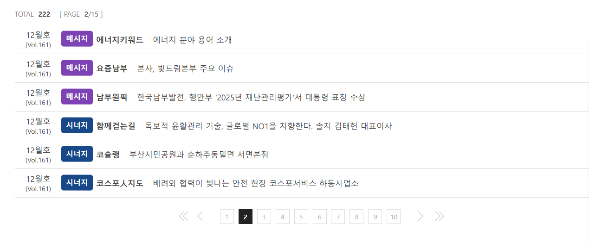
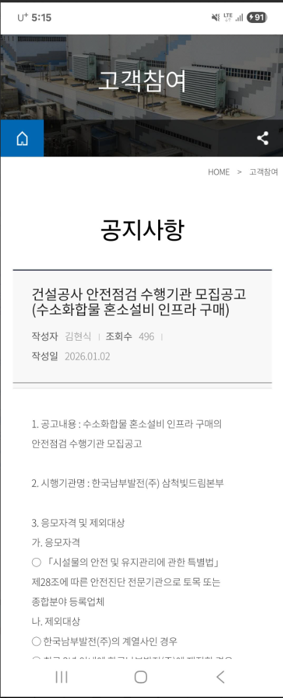
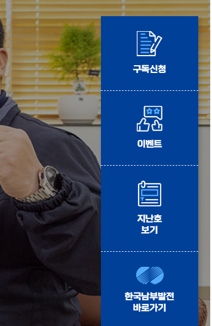
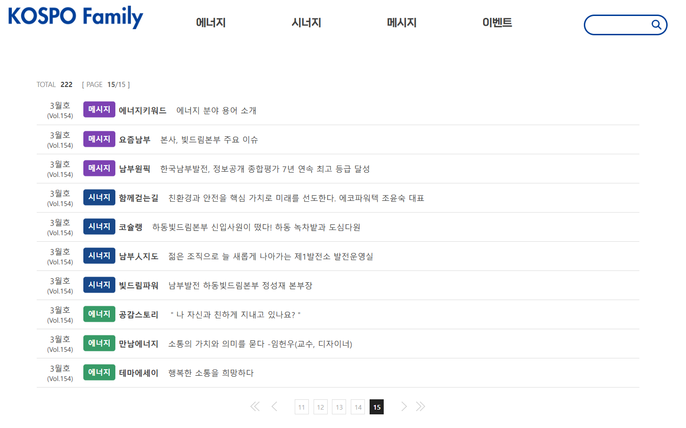
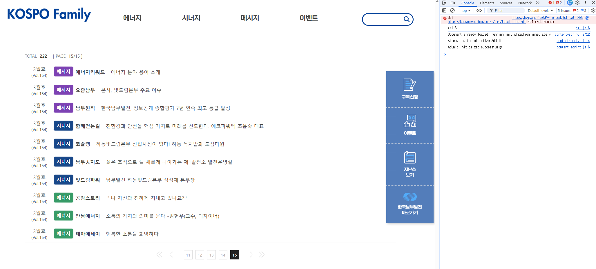
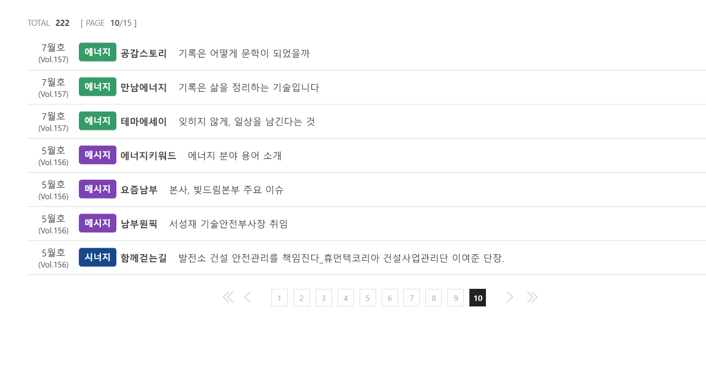
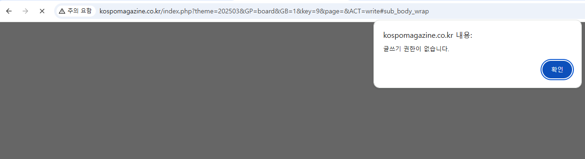
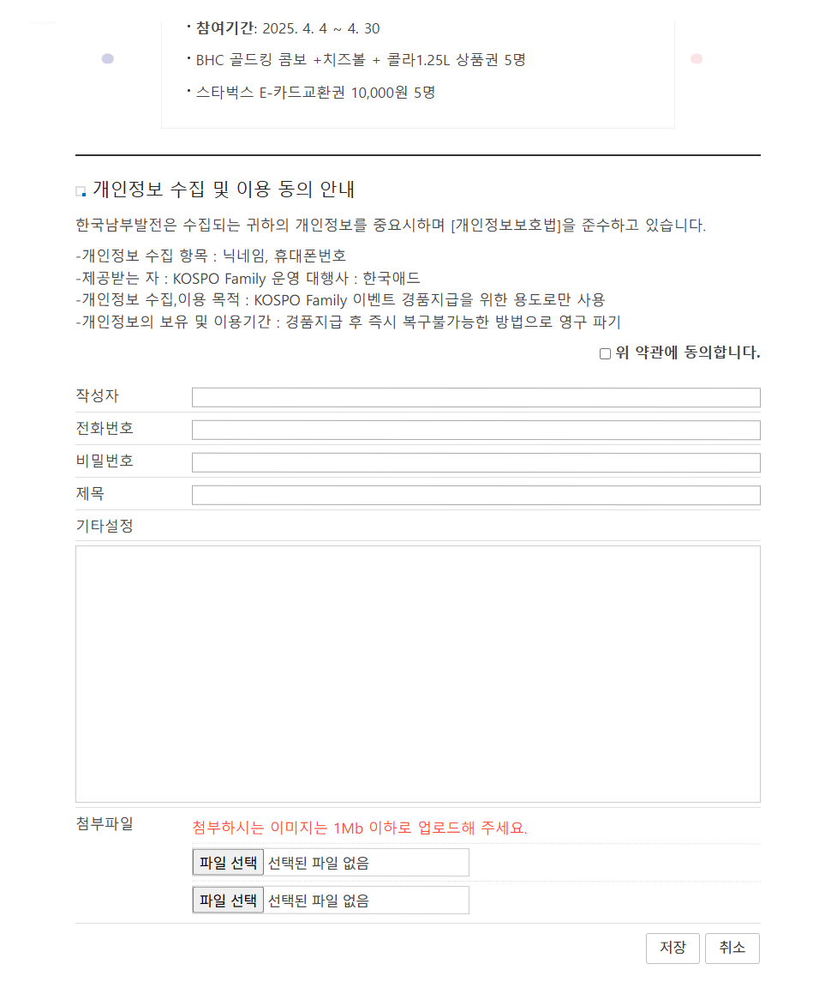

-------------------------------------------
참고(고려사항 및 참고사항)

1. 남부 기존 웹진 기술적인거 고려
    (1). 게시판형
    KOSPO 빛드림

    드림 KOSPO
    http://kospomagazine.co.kr/page/vol133/board2.php
    .....
    (2). 대상 사내/사외 여부

    (3). 몇월달건지 나오지가 않냐
    http://kospomagazine.co.kr/
    (4). 지난호 보기 더럽게 불편하네
    
    (5). 이벤트(퀴즈)형태 참고
    1). http://kospomagazine.co.kr/page/vol118/view.php?idx=81
    / http://kospomagazine.co.kr/page/vol118/view.php?idx=81 언제껀진 모름
    
    http://kospomagazine.co.kr/index.php?page=2&GP=event/pic&theme=202509&GB=2

    (6). 웹진 내용 정리
    
    - 가. 웹진 및 통합본 책자 인쇄
        1) 웹진 
        ­ 반응형 웹 형태로 제작하여 PC, 모바일, 태블릿 등 브라우저 크기에맞게 웹진 사이즈 변경될 수 있도록 구성
        ­ 게재되는 웹진은 고령자 및 장애인 등 웹사이트 이용에 불편이 없도록 한국형 웹콘텐츠 접근성 ※지침을 준수※하여 제작
        ­ 웹진에 관한 기술협조 및 웹진 유지·보수 주관하며, 발주자의 보안관련 조치사항 반영(웹진 인터넷 가상서버 이용 중)
        ­ 웹진 뉴스레터 발송(웹진 오픈시 콘텐츠 안내)　 ※smtp, 웹메일???※ check
        👉 게재되는 웹진은 고령자 및 장애인 등 웹사이트 이용에 불편이 없도록 한국형 웹콘텐츠 접근성 ※지침을 준수※하여 
        웹접근성 마크 여부 확인
        - https://www.kospo.co.kr/kospo/186/subview.do 지들 홈페이지에는 있음
        - http://kospomagazine.co.kr/index.php?theme=202509
        http://kospomagazine.co.kr/new/vol149/
        http://kospomagazine.co.kr/new/vol153/
        **https://www.i-award.or.kr/Web/Assess/FinalCandidateView.aspx?REG_SEQNO=10106** 👉 이건 뭐니?
        웹진 페이지에는 없음 한국형 웹콘텐츠 접근성 ※지침을 준수※하여 제작 👉 준수만 하면되니?
        웹진은 준수 안해도 되니?
        http://kospomagazine.co.kr/index.php?GP=event/pic&GB=2&key=169&page=5&ACT=read#sub_body_wrap
         👉 이거 문제 되겠네 별도 마크다운으로 작성 중....
         👉 이벤트 참석 시 개인정보 그런 문구 있는지 이벤트 어떻게 참석 되는지가 확인이 필요하다...
         👉 **이벤트 등록 절차랑 이벤트의 진행 절차에 대한 확인이 필요하다.**
          - 참고
          한국형 웹 콘텐츠 접근성 품질인증(WA 품질인증) 획득 비용은 사이트의 규모(페이지 수)에 따라 다르며, 보통 VAT 별도로 약 70만 원에서 300만 원 이상까지 다양합니다.
          한국정보접근성인증평가원(WA.or.kr) 기준, 대략적인 신규 심사 비용은 다음과 같습니다. 
          소규모 (1~20페이지 내외): 약 120만 원 내외 (VAT 별도)
          중규모 (21~99페이지): 약 150만 원 내외 (VAT 별도)
          대규모 (100페이지 이상): 별도 견적 (페이지 수가 많을수록 증가) 
          주요 특징 및 비용 요소
          인증 유효기간: 1년 (1년마다 갱신 필요)
          비용 변동 요소: 사이트의 복잡도, 서비스 기능, 페이지 수에 따라 샘플링 및 심사 대상이 늘어나면 비용이 증가할 수 있습니다.
          갱신 심사: 신규 심사보다 비용이 다소 낮게 책정됩니다. 
          참고: 한국디지털접근성진흥원(KDAA) 등 다른 인증기관과 다소 차이가 있을 수 있으며, 최종 비용은 신청 전 인증기관을 통해 정확한 견적을 받아야 합니다.
          https://www.kcisa.kr/kr/contents/wa_mark/view.do
          https://www.webwatch.or.kr/WA/010401.html?MenuCD=140
          
 (7). 웹접근성 정리
 1). 웹진 완전히 다른 도메인
 👉 별도 운영 웹진:
 본사이트 : https://company.kr/webzine
 웹진 : https://magazine.company.kr
 
 👉 한국형 웹콘텐츠 접근성 획득 마크 없음
 👉 메인 홈페이지에 ‘웹 접근성 품질마크’가 있어도,
 별도 분리된 웹진(서브사이트/서브도메인/마이크로사이트 등)이 독립적으로 운영되는 경우는
 웹진까지 별도 인증을 받아야 마크를 표시할 수 있습니다.
 👉 심사비용 :https://www.wa.or.kr/m1/sub4.asp
 
 2). **한국형 웹콘텐츠 접근성 ※지침을 준수※하여 제작**
 
 3). 3. 용역범위
 ○ 웹진 관련 이벤트 진행 및 웹진 활성화 방안 제시
 ...
 👉 1. 용역 세부내역
 가. 웹진 및 통합본 책자 인쇄
 - 게재되는 웹진은 고령자 및 장애인 등 웹사이트 이용에 불편이 없도록 한국형 웹콘텐츠 접근성 ※지침을 준수※하여 제작
 - 웹진에 관한 기술협조 및 웹진 유지·보수 주관하며, 발주자의 보안관련 조치사항 반영(웹진 인터넷 가상서버 이용 중)
 👉 상기 기재된 2), 3) 문구로 인해 외주사에 과실이 발생
 👉 서버, 웹페이지 범위 까지의 유지보수 인지
 👉 메인 홈페이지에 ‘웹 접근성 품질마크’가 있어도, 그 별도 분리된 웹진(서브사이트/서브도메인/마이크로사이트 등)이 독립적으로 운영되는 경우는 그 웹진까지 별도 인증을 받아야 마크를 표시할 수 있습니다.
 > 👉 
 

 ⚠️ 위험 케이스
1. 외주사가 이벤트 페이지 구조 기획 
2. 개인 블로그 연계 제안 
3. 이미지 직접 업로드/가공 
4. 접근성 위반 요소를 알고 있었는데 개선 제안/경고 기록 없음 
5. 계약서에 책임 범위가 애매하게 적혀 있음 
“사이트 전반 유지관리” 식의 표현 
6. 이러면 감사에서:“외주사도 전문성 있는 수행기관으로서 관리 책임 일부 있음” 
7. ... 상세 사향 웹진 제안서 메모2, 웹 접근성 품질마크 문서 참고 ...
 

 
5). 주요 문제 페이지  
     👉 http://kospomagazine.co.kr/index.php?GP=event/pic&GB=2&key=169&page=5&ACT=read#sub_body_wrap  
     👉 개인 블로그의 개시글과 개인이 촬영된 이미지가 노출  
     👉 이벤트 참석 시 개인정보에 대한 동의 문구 등/이벤트 등록 절차/상세한 이벤트 참석 절차 확인  
6). 책임 소재 회피가 어려울 것으로 보임  
     **👉 발주처인 고객사와 기존 유지보수 업체와 어떤 협의 내역이 있었는지 향후 어떤방안로 진행 할지 확인 필요**  
7). 인증기관에 문의해 “웹진도 인증 범위에 포함되는지” 확인  
     👉 “웹진 페이지의 인증 히스토리 등에 대한 내역 확인 필요  
8). ※ 결론적으로는 사실상 암암리에 협의하여 운영 중일 가능성이 크다  
    
----------------------------------------------------------------------

(8). 웹진 동작 방식 정리
  👉 웹진 페이지에 년월 표기가 안되어서 불편하다. 

  2023년

- 게시판
>👉 일반적 게시글의 url 형태 http://kospomagazine.co.kr/page/vol133/05.php  
👉 게시판형 게시글의 url 형태  
&nbsp;&nbsp;✔ http://kospomagazine.co.kr/page/vol133/board2.php, &http://kospomagazine.co.kr/page/vol144/board.php, http://kospomagazine.co.kr/page/vol144/board_view2.php?idx=649&menu=&keyword=  
>👉 
>👉 무조건 최신 글이 상단에 노출
>👉 board.php, board2.php가 vol144에 따라 다른 데이터 가져온다. 년월 구분없고 vol144에 있는거 다 가져오는 듯  
👉 상세 보기는 board_view.php에서 idx=658로 구분  
👉 https://www.kospo.co.kr/kospo/768/subview.do 구독 기능이 있는걸로 보아 신규 등록 시 메일이 발송될듯, 구독 해봤는데 지금은 메일 발송이 안되서 확인이 불가

>> 

>> 1. 게시판 형태 게시글에는 sns 공유가 있다. 
>> 2. 웹 접근성을 준수하는 SNS 공유 기능은 장애인, 노인 등 모든 사용자가 소셜 미디어 플랫폼(페이스북, X(트위터), 카카오톡 등)을 통해 정보를 공유할 수 있도록 보장하는 것입니다. 한국웹접근성인증평가원의 지침 및 WCAG 2.1 기준에 따라 구현해야 합니다. 
>> 3. 웹접근성 고려 부분 
>> 

  - 이벤트
  👉 이벤트(퀴즈)형태 참고
  http://kospomagazine.co.kr/page/vol118/view.php?idx=81
  / http://kospomagazine.co.kr/page/vol118/view.php?idx=81 언제껀진 모름
  http://kospomagazine.co.kr/index.php?page=2&GP=event/pic&theme=202509&GB=2
  http://kospomagazine.co.kr/index.php?theme=202511&GP=event/pic&GB=2
  GB=2 👉 요게 게시판 보드 구분하네???

> 👉 나머지는 그냥 게시판 기능이다

  2023년 / 게시판 댓글, 검색, 페이징 없음 끝

  2024년

- 게시판
> 👉 2024년 부터는 SNS 공유 버튼 빠짐  
> 👉 vol146 볼륨명으로 년월을 구분하여 데이터를 가져오는 것으로 예상된다
>👉 일반적 게시글의 url 형태  
&nbsp;&nbsp; https://kospomagazine.co.kr/new/vol146/s14.php  
👉 게시판형 게시글의 url 형태  
&nbsp;&nbsp; https://kospomagazine.co.kr/new/vol146/s32.php(점입가경 > 요즘 남부)  
url 형태가 동일한것으로 보아 각 php 파일이 기능이 다른듯 하다 s32.php
vol###에 따라서 게시글 리스트를 가져온다.

- 이벤트
>👉 이벤트형 게시글의 url 형태(사진 한 컷 : 이벤트)  
https://kospomagazine.co.kr/new/vol146/event.php
>> 

>> 1. 이벤트만 다름 
>> 2. 심지어 이벤트는 ssl 적용되어 있음 보안 때문인듯  
>> https://kospomagazine.co.kr/new/vol146/event.php 
>> 3. 이벤트가 종료 되었습니다. : 이벤트 종료 플래그 값이 존재하거나 일자 체크할 듯 
>> 4. 선정된 사진은 다음 호에 소개해드릴게요. : 이전호의 당천이벤트 정보를 현재호차에서 가져온다, 근데 당첨된 이벤트 정보 어디 있다는겨 다음호에 없는데??? ⚠️
>> 5. https://kospomagazine.co.kr/new/vol147/event.php#event_point, https://kospomagazine.co.kr/new/vol148/event.php : 이 4/5월 이벤트는 왜 참여기간이 중복??(2024.5.31. ~ 6.24.), 이벤트가 중복이고 내용도 중복이었네 
>> 6. 이벤트 응모 프로세스는 확인 필요(참여자 정보 입력, 당첨 결과 sms등의공지 방안 등)
>> 

보류보류보류보류보류보류보류보류보류보류보류보류보류보류보류보류
> 👉 http://kospomagazine.co.kr/index.php?theme=202511&GP=board&GB=9&key=956&page=&ACT=read#sub_body_wrap
  

  2024년 끝

  🔴🔴🔴🔴🔴🔴🔴🔴 2025년 시작1 🔴🔴🔴🔴🔴🔴🔴🔴

  
👉 https://www.kospo.co.kr/kospo/768/subview.do 구독 기능이 있는걸로 보아 신규 등록 시 메일이 발송될듯, 구독 해봤는데 지금은 메일 발송이 안되서 확인이 불가  

>  | ✔ 구독 여부를 알리는 메일이 발송 되면 좋을듯, ✔ 구독 중복은 안되네
> 👉 http://kospomagazine.co.kr/index.php?theme=202511&GP=board&GB=9  ✔ 2025년 12월의 링크 확인이 필요
> ✔ http://kospomagazine.co.kr/index.php?theme=202511, http://kospomagazine.co.kr/index.php?theme=admin, http://kospomagazine.co.kr/index.php?theme=202601, ✔ 3개 링크는 정확이 몇년몇월의(몇호) 웹진인지 
>     ○ 정기보고 : 분기 1회 정기회의 개최
­ KOSPO Family 분기 운영실적 및 차회 기획(안) 보고 
­ 주요 이슈사항 토론 및 대응방안 수립  | ✔ 제안서의 상기 내용을 보아 방문자 통계 기능이 있을듯 하다  
,   ✔ **얘 처럼 어느 페이지 어느 부분 보고 있는지 기능이 따로 없음 ⚠️ 오류는 아니다만 너무 불편하다.**
> 👉 2026년 1월호로 가능 링크가 리스트에는 빠져 있네 ⚠️

- 게시판

> 👉 지난호 보기를 이전 월 웹진을 보여 주던가 해야지 무조건 목록으로 보내지 말고 ⚠️ 오류는 아니다만 너무 불편하다.
>  | ✔ 우측 네비게이션 메뉴 좋은듯 무조건 살려야됨 이벤트 참가하러 방문할 수도
> 👉 2025년도 SNS 공유 버튼 빠짐 | ✔ 굳이 공유 해가진 않을 것 같긴함  
>👉 일반적 게시글의 url 형태  
&nbsp;&nbsp; http://kospomagazine.co.kr/index.php?theme=202503&GP=board&GB=1&key=1&page=&ACT=read#sub_body_wrap  
&nbsp;&nbsp; http://kospomagazine.co.kr/index.php?theme=202504&GP=board&GB=4&key=87&page=&ACT=read#sub_body_wrap  
&nbsp;&nbsp; http://kospomagazine.co.kr/index.php?theme=202505&GP=board&GB=5&key=120&page=&ACT=read#sub_body_wrap  
👉 http://kospomagazine.co.kr/index.php?page=4&GP=board&GB=search&theme=202503&sf_field=title_body&sf_txt=%ED%96%89%EB%B3%B5: 

👉 게시판형 게시글의 url 형태  
&nbsp;&nbsp; http://kospomagazine.co.kr/index.php?theme=202503&GP=board&GB=1&key=9&page=&ACT=read#sub_body_wrap(에너지 > 테마에세이) | ✔ 참고 게시글 새창으로 뜸  
✔ http://kospomagazine.co.kr/index.php?theme=202503&GP=board&GB=1&key=2&page=&ACT=read#sub_body_wrap(시너지 > 만남에너지)  
✔ http://kospomagazine.co.kr/index.php?theme=202503&GP=board&GB=1&key=4&page=&ACT=read#sub_body_wrap(시너지 > 빛드림파워)  
✔ index.php?theme=202503&GP=board&GB=1&key=9&page=&ACT=read#sub_body_wrap
✔ index.php?theme=202503&GP=board&GB=1&key=2&page=&ACT=read#sub_body_wrap
✔ index.php?theme=202503&GP=board&GB=1&key=4&page=&ACT=read#sub_body_wrap(일반적 게시글 비교용)
  

- 글목록

👉 ※ 검색결과 페이지의 ※ url 형태 http://kospomagazine.co.kr/index.php?page=1&GP=board&GB=search&theme=202503&sf_field=title_body&sf_txt= | ✔ 몇년도 몇월인지는 왜 다 빠져있는건가
| ✔  | ✔ http://kospomagazine.co.kr/index.php?page=14&GP=board&GB=search&theme=202503&sf_field=title_body&sf_txt= 리스트페이지 인데 14페이지 누르니까 아무것도 안나오네?, 페이징 오류 ⚠️
, ,  | ✔ 페이징도 들쭉날쭉하고 한페이지에 한개 월의 리스트를 보여주는게 좋을듯? 아님 페이징을 번호가 아니라 년/월로 선택하면 편리할듯? ⚠️

>> 

>> 1. 해당년도의 모든 게시글의 리스트를 확인, 검색 
>> 2. 리스트에서 게시글의 분류 확인 가능 
>> 3. 링크 복사, 인쇄 기능, 목록으로 가기 댓글 그런건 없고 단순 조회 기능만
>> 

>👉   
>> 

>> 1. 글쓰기 권한  
>> 

/////////////////////////////////////////////////////////////////////////////////////////////

- 이벤트
>👉 이벤트형 게시글의 url 형태(사진 한 컷 : 이벤트) | ✔ 당첨자 알림용 기능이 있을거고 여기에서 지난 이벤트 글을 볼수 있네 당첨된 이벤트 글은 볼수가 없네 | 지난호의 이벤트 내용과 이벤트 참여 글을 볼수 있었으면 한다 진심으로 궁금했다. 혹시 뉴스레터나 구독 메일로 발송이 되는지?  
✔ 선정된 사진은 다음 호에 소개해 드릴게요. ⚠️ 이건 오류라기 보단 없는 기능을 소개 하고 있어서 문제
✔ http://kospomagazine.co.kr/index.php?GP=event/pic&GB=2
✔ http://kospomagazine.co.kr/index.php?GP=event/pic&GB=2&key=1015&page=&ACT=read#sub_body_wrap 
✔ http://kospomagazine.co.kr/index.php?GP=event/pic&GB=2&page=1&ACT=list
✔ http://kospomagazine.co.kr/index.php?GP=event/pic&GB=2&page=1&ACT=write - ※※※※※ 글쓰기 ※※※※※

> 👉 이벤트 화면들이고 웹진 웹 자체에 글 데이터가 저장 되는걸로 보인다.
> 아무나 들어와서 막쓰게 되므로 관리가 지속적이어야 하며 관리하는 페이지나 글쓰기 시 알림이 갈것으로 예상된다 그렇지 않으면 관리자 힘들것 같음, 하지만 그렇게 까지 중요도가 높은 시스템은 아닌것으로 예측 되기도

>> 

>> 1. 이벤트만 다름 
>> 2. 심지어 이벤트는 ssl 적용되어 있음 보안 때문인듯  
>> https://kospomagazine.co.kr/new/vol146/event.php 
>> 3. 이벤트가 종료 되었습니다. : 이벤트 종료 플래그 값이 존재하거나 일자 체크할 듯 
>> 4. 선정된 사진은 다음 호에 소개해드릴게요. : 이전호의 당천이벤트 정보를 현재호차에서 가져온다, 근데 당첨된 이벤트 정보 어디 있다는겨 다음호에 없는데???
>> 5. https://kospomagazine.co.kr/new/vol147/event.php#event_point, https://kospomagazine.co.kr/new/vol148/event.php : 이 4/5월 이벤트는 왜 참여기간이 중복??(2024.5.31. ~ 6.24.), 이벤트가 중복이고 내용도 중복이었네 
>> 6. 이벤트 응모 프로세스는 확인 필요(참여자 정보 입력, 당첨 결과 sms등의공지 방안 등)
>> 

> 👉 웹진의 데이터
  http://kospomagazine.co.kr/page/vol118/view.php?idx=81
  / http://kospomagazine.co.kr/page/vol118/view.php?idx=81 언제껀진 모름
  http://kospomagazine.co.kr/index.php?page=2&GP=event/pic&theme=202509&GB=2
  http://kospomagazine.co.kr/index.php?theme=202511&GP=event/pic&GB=2
  GB=2   요게 게시판 보드 구분하네???

  🔴🔴🔴🔴🔴🔴🔴🔴 2025년 끝1 🔴🔴🔴🔴🔴🔴🔴🔴

  2025년 참고1

2025년 참고끝1

  (9). 웹진의 평가 부분 정리
 (10). DB 내용 정리
    DB 쓰는듯 
  - 게시판
  👉 http://kospomagazine.co.kr/index.php?theme=202511&GP=board&GB=9&key=956&page=&ACT=read#sub_body_wrap
  http://kospomagazine.co.kr/index.php?theme=202511&GP=board&GB=9 뒤에거 없으니까 리스트로 가네? ⚠️
  👉 

            
    ---------------------------------------------------------------------------
    
 (11). 사보 통합본 제작시 시각장애인용 접근성 PDF 제작·전환
 👉 시각장애인용 접근성 PDF는 Adobe Acrobat Pro 등의 도구를 활용해 대체 텍스트(Alt text) 추가, 논리적 태그(Tag) 지정, 문서 구조화 (제목, 목록 등)를 적용하여 제작합니다. 화면 낭독기(Screen Reader)가 텍스트를 올바르게 읽을 수 있도록 문서 구조 검사 후 '실패'  항목을 수정하여 최종 배포합니다. 
 주요 접근성 PDF 제작 단계
 구조적 태그 지정: PDF의 읽기 순서가 논리적인지 확인하고, 제목(Heading), 본문, 목록 등을 태그로 정의합니다.
 대체 텍스트(Alt Text) 추가: 이미지, 도표, 그래프에 시각적 정보를 설명하는 대체 텍스트를 삽입하여 화면 낭독기가 읽을 수 있게 합니다.
 문서 언어 설정: 문서의 기본 언어를 설정하여 낭독기가 적절한 언어 팩을 사용하도록 합니다.
 보안 설정 확인: 화면 낭독기 접근을 제한하는 보안 설정을 해제합니다.
 접근성 검사: Adobe Acrobat의 '접근성 검사' 기능을 사용하여 태그, 색상 대비, 대체 텍스트 등 오류를 수정하여 녹색으로 통과되도록  합니다. 
 추가 팁
 폰트: 가독성이 좋은 폰트(명조, 고딕 계열)를 사용하고, 폰트 크기를 적절히 유지합니다.
 배경/문자 색상: 명도 대비가 높은 색상을 사용하여 저시력자도 쉽게 읽을 수 있도록 합니다.
 목차 및 북마크: 긴 문서의 경우, 북마크 기능을 통해 시각장애인이 필요한 정보로 빠르게 이동할 수 있게 합니다. 
 👉 https://www.google.com/search?q=%EC%8B%9C%EA%B0%81%EC%9E%A5%EC%95%A0%EC%9D%B8%EC%9A%A9+%EC%A0%91%EA%B7%BC%EC%84%B1+PDF +%EC%A0%9C%EC%9E%91&oq=& gs_lcrp=EgZjaHJvbWUqCQgAEEUYOxjCAzIJCAAQRRg7GMIDMgkIARBFGDsYwgMyCQgCEEUYOxjCAzIJCAMQRRg7GMIDMgkIBBBFGDsYwgMyCQgFEEUYOxjCAzIJCAYQ RRg7GMIDMgkIBxBFGDsYwgPSAQg2MjNqMGoxNagCCLACAQ&sourceid=chrome&ie=UTF-8
 👉 위의 내용인지 확인 필요하며 소요 비용에 대한 부분도 확인 필요
 👉 알아서 하라는거야 뭐야
 
 (12). 현재 미흡점 및 향후 개선 방안(구성방안)

    ----------------------------------------------------------------------
    

1. 웹진 제안서 참고 1
    (1). 매우 디테일한 통계분석 시스템
    서비스 부가서비스개요
    일반적인 접속자의 숫자만 통계할 수 있는 것이 아닌 접속자의 국적, 위치, 접근환경, 접근경로, 시간, 키워드, 자주 이
    용하는 메뉴등을 한 눈에 파악할 수 있는 통계분석을 제공
    .......

    (2). SEO 최적화: 검색 엔진에서 잘 노출되도록 최적화합니다.+
    👉 검색 잘되도록
    👉 CSR과의 비교 (SEO 관점)
    SSR (Server Side Rendering): 초기 데이터가 포함된 HTML을 서버에서 가져와 SEO에 유리하다.
    CSR (Client Side Rendering): 빈 HTML을 가져와 브라우저에서 JS로 내용을 채우므로 봇이 데이터를 수집하기 어려워 SEO에 불리할 수 있다.

    (3). 운영도 admin 페이지를 통해 직접 할 수도 있고 웹진을 제작해 준 업체를 통해 외주를 맡길 수도 있습니다.

    (4). 잡지나 사보를 발행하는 기업은 이미 콘텐츠가 있기 때문에 결과물 또는 기존 원고를 바탕으로 웹진을 제작하면 되는데요. 그러면 웹 디자인과 추가되는 기능 정도만 신경 쓰면 되겠죠? 이런 방식으로 운영(사보+웹진) 하고 있는 대표적인 기업이 MG 새마을금고에서 발행하고 있는 ‘MG MAGAZINE‘이 있습니다.
    (5). 마크다운 참고하고 "웹진 관련 이벤트 진행 및 웹진 활성화 방안 제시", "웹진에 관한 기술협조 및 웹진 유지·보수 주관하며, 발주자의 보안관련 조치사항 반영" 이문구 유의

    ------------------------------------------
    1️⃣ 웹진의 역할을 명확히 정의하라
    많은 기업이 “사보를 디지털로 옮기자”는 이유로 웹진을 시작합니다.
    하지만 웹진은 사보의 복제본이 아닙니다.

    사내 직원 소통 중심이라면 ‘참여형 콘텐츠’가 필요하고,
    대외 홍보 중심이라면 ‘브랜드 스토리텔링’이 중요합니다.
    👉 목적이 분명해야 웹진의 구조, 디자인, 운영 방향이 결정됩니다.

    3️⃣ 기술보다 운영이 중요하다
    웹진 만들 때 워드프레스, **노션**, 퍼블리 등 다양한 플랫폼을 고민하지만
    도구보다 중요한 건 ‘운영 지속성’입니다.

    --------------------------------------------
    부산문화재단
    https://www.bscf.or.kr/view.do?no=1018
    주택금융공사
    https://www.hf.go.kr/_res/rgwebzine/webzine_03/index.html

    ----------------------------------------------------------------------

2. 붙임2. [2024-09호] (제안요청서) (입찰공고문) 아르코웹진(A SQUARE)기획 및 발간 용역

3. https://webzinn.com/ 모두의 웹진
(1). 필요한 기능을 언제든지 추가하여 효율적으로 운영, 방문자 통계
(2). Q. 제작 완료 후 추가 수정이나 업데이트는 가능한가요?
네, 제작 완료 후에도 수정이나 업데이트가 가능하며, 간단한 텍스트 수정, 오탈자 수정은 1개월 동안 무료 서비스로 진행해 드리고 있습니다.

4. 👉 3. 용역범위
  ○ 웹진 기획·디자인·제작·발행·웹진 뉴스레터 발송, 관리 일체 
    ­ 웹진에 관한 기술협조 및 웹진 유지·보수 주관  | ✔ 이부분에 🔴 유의하라

4. 9) 국내외 공신력 있는 커뮤니케이션 관련 상(賞) 출품 등 기타 사항 지원